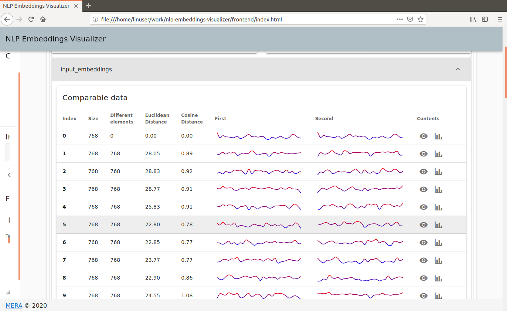
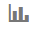
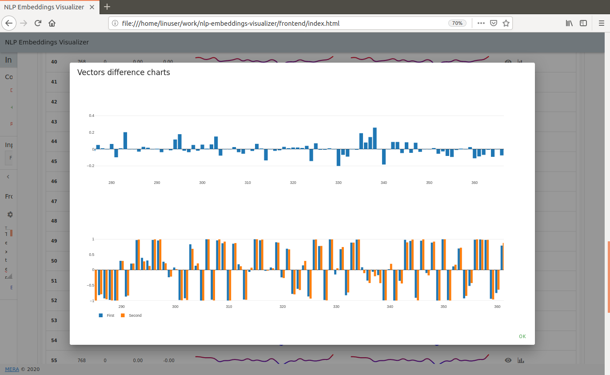
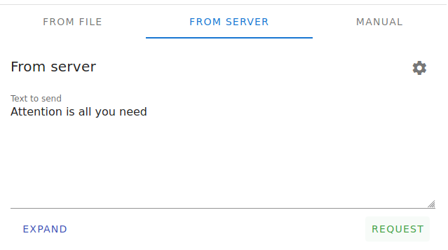
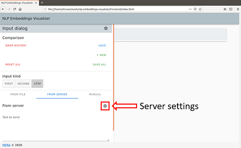

# NLP Embeddings Visualizer

Compares embedding vectors for two different texts visually and by numerical metrics. At the present time [BERT-Base, Cased](https://github.com/google-research/bert#pre-trained-models) (12-layer, 768-hidden, 12-heads, 110M parameters, English language) in [DeepPavlov](https://github.com/deepmipt/DeepPavlov) library is used, but it can be extended in the future if needed.

Both input and output embeddings from BERT can be compared for two consecutive text inputs. This allows empirical investigation of model characteristics. Vectors are compared by visual silhouette, Euclidean and [Cosine](https://en.wikipedia.org/wiki/Cosine_similarity) distances, and also by difference and side-by-side graphs.

Comparison by visual silhouettes and distance metrics:  


Comparison by difference and side-by-side graphs (opened by clicking  on the right):  


## Usage

1. Enter the first text into the input field and press "REQUEST" button  

   * You should see blue message `Fetching new data from server, do not change input kind until the loading finished`
   * If you see red message `Promise error 'TypeError: NetworkError when attempting to fetch resource.'` please check that server container is running and its address is configured properly, see [Start and Stop](#start-and-stop) section for details
   * When text is received, you should see the green message `Successfully received`
   * **Note:** First execution can take several seconds while the model is loaded into memory
1. Enter the second text into the same input field and press "REQUEST" button
1. After the reply from the server, you should see results in the main window

## Start and Stop

1. Build Docker container with BERT model
   ```
   cd backend
   docker build -t "mera_nlp_embeddings_server" -f docker_container_src/Dockerfile .
   ```
1. Start this container on your local machine or server and choose port to listen
   ```
   docker run --rm -d -p 8888:5000 --name "mera_nlp_embeddings_server_container" "mera_nlp_embeddings_server"
   ```
   Here `8888` is the port number, which will be listened to on the host where the container has started. You can use another value if needed.
1. Open HTML file with frontend in browser:
   ```
   <path/to/repository>/frontend/index.html
   ```
   Note: If you see the message `Unable to load stored config, will use the default instead`, it is OK for the first start.
1. If you launched the container not on the same machine or changed default port `8888`, correct address and port in the "Server Settings" window (opens by gear button) in "Server address" field  

1. You are ready to compare embeddings for different texts, as described in [Usage](#usage) section
1. Stop container when it is no longer used:
   ```
   docker stop "mera_nlp_embeddings_server_container"
   ```

## Prerequisites

* OS: Windows, Linux
* Docker installed
* Browser: Firefox or Chrome
* At least 4GB RAM on the host where container with BERT is started, BERT takes about 2.5 GB of RAM

## Authors

* **Alexander Ganyukhin** - *Frontend implementation, backend implementation*, [GitHub](https://github.com/alex-ganyukhin)
* **Georgy Dyuldin** - *Help with backend implementation*, [GitHub](https://github.com/gdyuldin)
* **Yury Yakhno** - *Idea, technical driving*, [GitHub](https://github.com/YuryYakhno)

See also the list of [contributors](https://github.com/mera-company/nlp-embeddings-visualizer/graphs/contributors) who participated in this project.

## Contributing

Please read [CONTRIBUTING.md](CONTRIBUTING.md) for details on the process for submitting pull requests to us.

## License

This project is licensed under the Apache 2.0 License - see the [LICENSE](LICENSE) file for details

## Dependencies on third-party products

This product includes software from the following projects:
* [Vue.js](https://github.com/vuejs/vue), distributed under MIT license
* [Vuetify](https://github.com/vuetifyjs/vuetify), distributed under MIT license
* [Plotly.js](https://github.com/plotly/plotly.js/), distributed under MIT license
* [Material Design Icons](https://github.com/Templarian/MaterialDesign-Webfont), distributed under SIL Open Font License

This product installs software from the following projects:
* [DeepPavlov](https://github.com/deepmipt/DeepPavlov), distributed under Apache-2.0
* [TensorFlow](https://github.com/tensorflow/tensorflow), distributed under Apache-2.0
* Projects in [Dockerfile](backend/docker_container_src/Dockerfile), distributed under their licenses
* Python packages in [requirements.txt](backend/docker_container_src/requirements.txt), distributed under their licenses

This product installs pre-trained BERT weights from [BERT project](https://github.com/google-research/bert), which are distributed under Apache-2.0


## Acknowledgments

* Whole team in MERA, who use BERT models for the discussion of project idea, help with coding and testing. Especially for Konstantin Kulikov and Leila Ishkuvatova as a part of this team.
* DeepPavlov team for the convenient library
